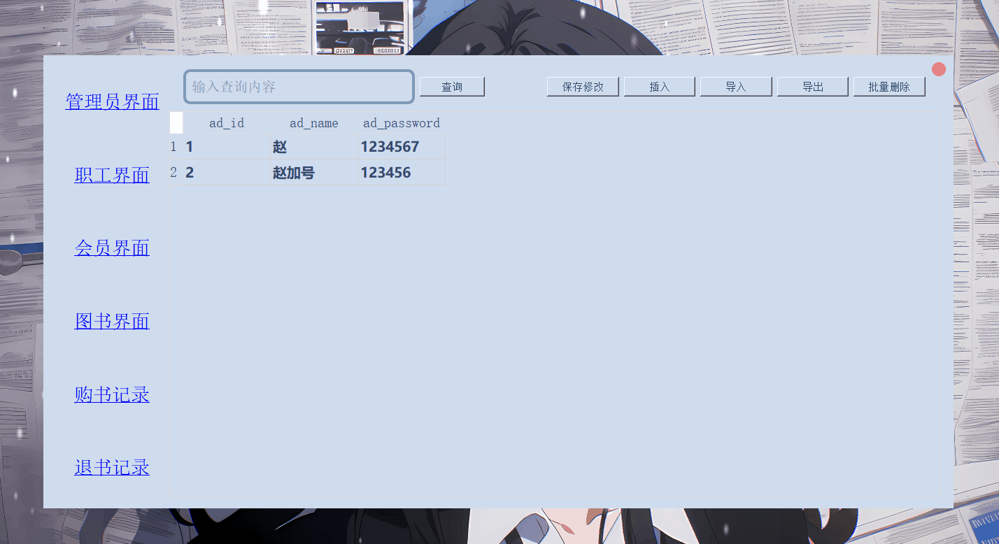

# BookStoreMangement

## 结构说明
1.   ./assist存放了用到的爬虫文件 和辅助生成CSV示例的一些文件 包括中途的一些测试性文件，程序最终的运行和此文件夹无关
2.   ./csv存放了csv文件 用来程序演示时“导入”功能的源文件，并且导出的csv文件也应该存放到这个文件夹
3.   ./UI存放了python格式的UI文件 
4.   ./UI_Source存放了QTDesigner的界面文件
5.   ./SQL存放了用到的sql文件
6.   ./images存放了UI界面的依赖文件，但没怎么用到
7.   ./fluent UI 存放了qt的一个第三方库 类似语法糖 没用到 只用到了一个网上找的样式表
8. 其余文件望文知意
## 运行
login.py 里有登录界面的测试
mainwindow.py 是主界面 有入口函数 可以单独测试
从login.py进入 输入管理员账号密码进入管理员界面 输入员工账号密码进入员工界面 实际两个界面并无差别 只是员工界面不能打开管理员表
之后一切操作 都可在管理员界面（mainwindow）操作
## 运行截图
1. 主界面

2. 各个界面之间切换

3. 插入演示（购书记录和退书记录不支持插入和删除）
* 弹出错误信息是因为添加了数据库的约束性条件

* 其他界面的插入类似
4. 批量导入、删除等功能演示

TODO：
会员折扣，实现插入会员信息的时候根据输入的会员类别自动设置折扣
