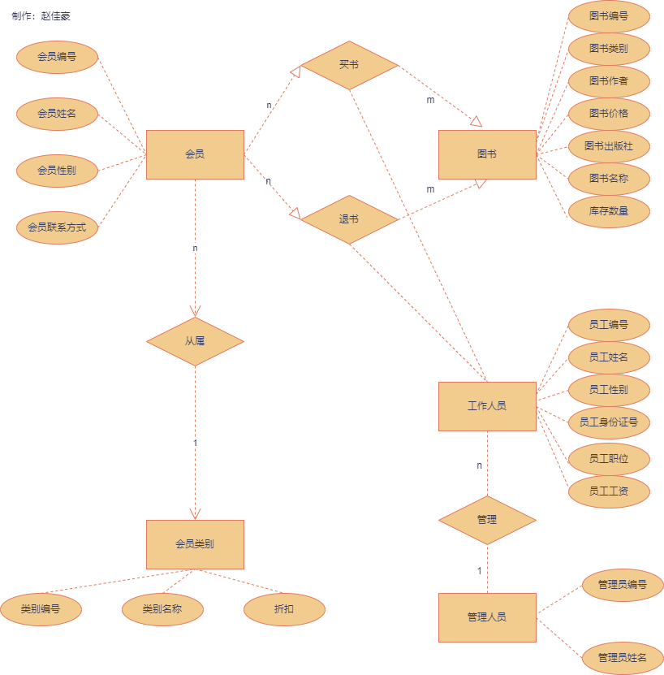

# 数据库实践作业需求分析

## 基本功能描述

1. 会员购买书籍，享受折扣，购买信息由工作人员登记
2. 会员对图书不满意，进行退货操作，由工作人员进行退款，并更新图书相关信息
3. 图书管理，书店进货，更新图书信息，如已经存在此图书，只更新数量，如不存在，录入图书信息，直接添加数量
4. 图书管理，卖书，更新卖出书籍的数据库信息，若数量低于某个限制，提醒工作人员进货
5. 管理人员管理工作人员，管理人员可以对工作人员的信息进行添加、修改和删除
6. 工作人员管理会员信息，工作人员可以对会员信息进行添加、修改和删除，再进行操作后生成相关文档
7. 工作人员管理图书信息，节日折扣，会员特殊折扣 

##  安全性和完整性要求

1. 完整性要求
2. 安全性要求
   1. 管理人员权限：查看修改工作人员信息，并具有工作人员的所有权限
   2. 工作人员权限：查看修改会员信息（除了会员联系方式，管理人员可见），查看修改图书信息
   3. 会员权限：查看图书信息（包含不同会员的折扣）

## 实体

会员（默认所有购书人员为会员）、会员类别（不同级别会员享受不同折扣）、图书、工作人员、管理人员（用来管理工作人员）

## 实体关系图



## 数据结构

1. 会员：
   * 会员编号、会员姓名、会员性别、会员类别、会员联系方式
2. 工作人员：
   * 员工编号，员工姓名，员工性别，员工身份证号，员工职位，员工工资
3. 管理人员：
   - 管理员编号，管理员姓名，（管理员密码）
4. 图书：
   * 图书编号，图书名称，图书出版社，图书价格，图书作者，图书类别， 图书库存数量
5. 会员类别：
   * 类别编号，类别名称，折扣
6. 购买记录：
   * 购买记录编号，购买时间，会员编号，会员联系方式，会员姓名，会员类别，图书编号，图书名称，办理人
7. 退书记录：
   * 退款记录编号，退款时间，会员编号，会员联系方式，会员姓名，图书编号，图书名称，办理人

git提交：
```
git add .
git commit -m "提交说明"
git push origin master:master
```

5.29问题记录：
1. 修改表 使得会员界面的会员类别只能从“普通会员”和“高级会员”中选择
2. 员工界面的员工性别同理

```
self.label_8.setText(_translate("MainWindow", "<a href='http://baidu.com'><html><head/><body><p align=\"center\"><span style=\" font-size:16pt;\">管理员界面</span></p></body></html></a>"))
self.label_13.setText(_translate("MainWindow", "<a href='#'><html><head/><body><p align=\"center\"><span style=\" font-size:16pt;\">职工界面</span></p></body></html></a>"))
self.label_5.setText(_translate("MainWindow", "<a href='http://baidu.com'><html><head/><body><p align=\"center\"><span style=\" font-size:16pt;\">会员界面</span></p></body></html></a>"))
self.label_12.setText(_translate("MainWindow", "<a href='http://baidu.com'><html><head/><body><p align=\"center\"><span style=\" font-size:16pt;\">图书界面</span></p></body></html></a>"))
self.label_11.setText(_translate("MainWindow", "<a href='http://baidu.com'><html><head/><body><p align=\"center\"><span style=\" font-size:16pt;\">购书记录</span></p></body></html></a>"))
self.label_14.setText(_translate("MainWindow", "<a href='http://baidu.com'><html><head/><body><p align=\"center\"><span style=\" font-size:16pt;\">退书记录</span></p></body></html></a>"))
```